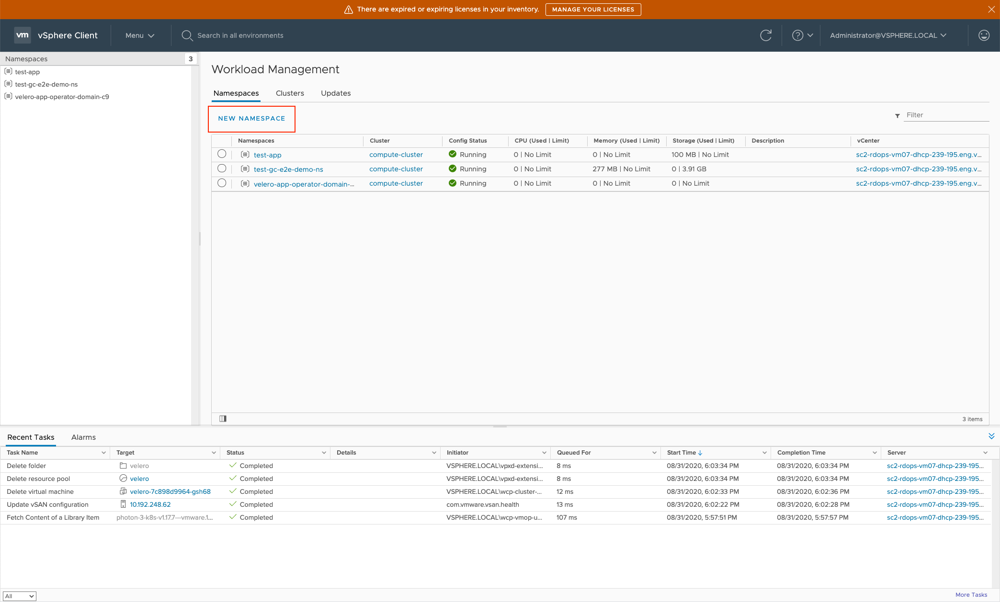
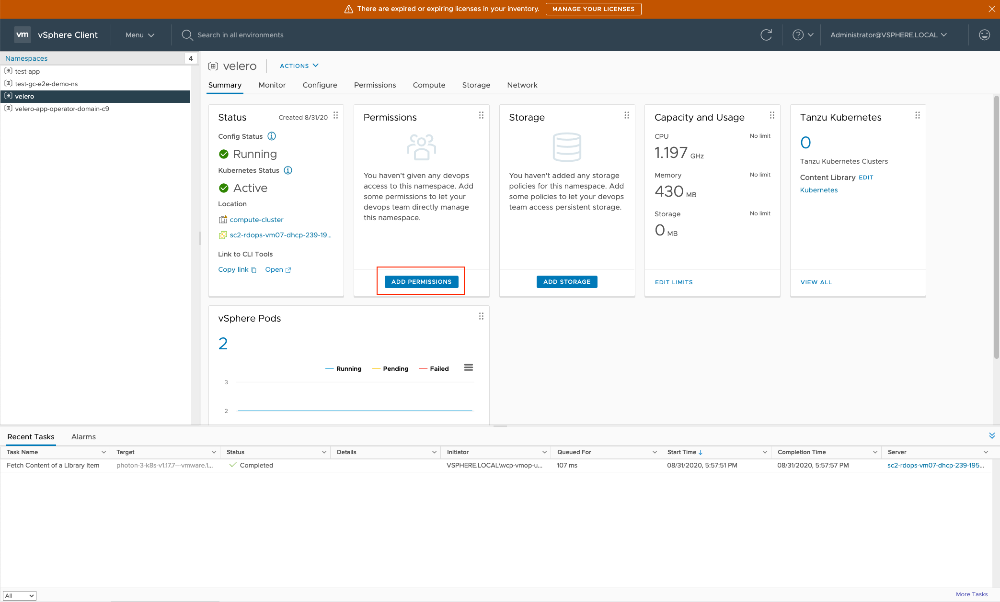
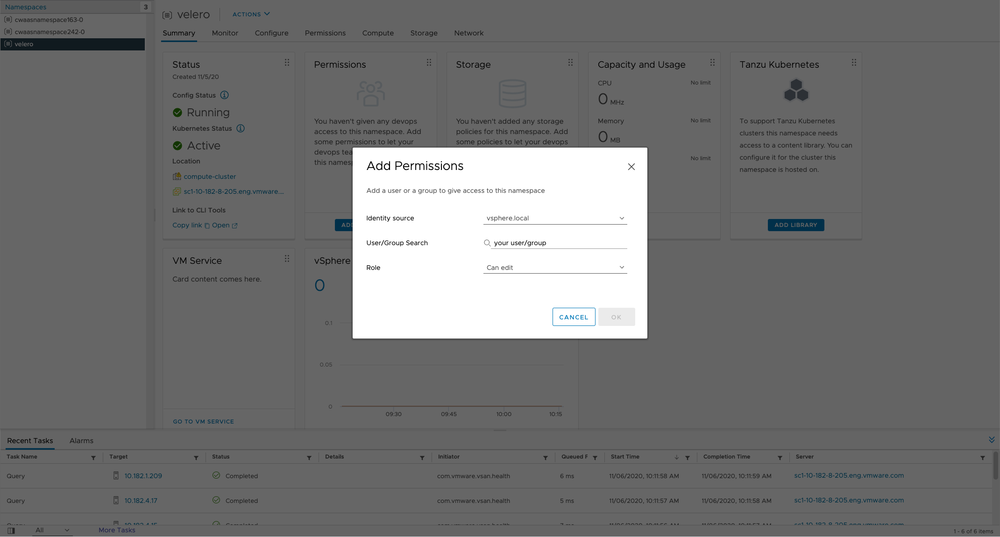

# User Workflow
Users here are expected to be vSphere users with access to

* vSphere UI
* Kubectl vsphere plugin

## Installing Velero on WCP supervisor cluster
1. Enable `Velero vSphere Operator` supervisor service via vSphere UI.
    

2. Create a supervisor namespace for Velero instance via vSphere UI. 
    
    
    And for user doesn't have VI Admin role, please add edit permission to the supervisor namespace.
    
    
    Below is an example. 
    

3. Run Velero vSphere operator CLI, **velero-vsphere**, to install velero into the same namespace created in step 2 above.
This can be done using a vSphere admin role (created by doing a "kubectl vsphere login" using sso user).
Assume Users have logged in `kubectl vSphere plugin` as vSphere SSO users.
Below are some examples for `velero-vsphere install`.

    **AWS S3**
    
    ```bash
    NAMESPACE="namespace of your choice"
    BUCKET="bucket of your choice"
    REGION="region of your choice, e.g., us-west-1"
    VSPHERE_PLUGIN=vsphereveleroplugin/velero-plugin-for-vsphere:1.1.0-rc1
 
    velero-vsphere install \
       --namespace $NAMESPACE \
       --version v1.5.1 \
       --provider aws \
       --plugins velero/velero-plugin-for-aws:v1.1.0,$VSPHERE_PLUGIN \
       --bucket $BUCKET \
       --secret-file ~/.aws/credentials \
       --snapshot-location-config region=$REGION \
       --backup-location-config region=$REGION
    ```

    **Minio**

    ```
    NAMESPACE="namespace of your choice"
    BUCKET="bucket of your choice"
    REGION=minio
    S3URL="minio url of your choice"
    VSPHERE_PLUGIN=vsphereveleroplugin/velero-plugin-for-vsphere:1.1.0-rc1
    
    velero-vsphere install \
        --namespace $NAMESPACE \
        --version v1.5.1 \
        --provider aws \
        --plugins velero/velero-plugin-for-aws:v1.1.0,$VSPHERE_PLUGIN \
        --bucket $BUCKET \
        --secret-file ~/.minio/credentials \
        --snapshot-location-config region=$REGION \
        --backup-location-config region=$REGION,s3ForcePathStyle="true",s3Url=$S3URL
    ```
    
    **Customized Object Store Plugin (e.g. PPDM)**

    ```
    NAMESPACE="namespace of your choice"
    VSPHERE_PLUGIN=vsphereveleroplugin/velero-plugin-for-vsphere:1.1.0-rc1
    
    velero-vsphere install \
        --namespace $NAMESPACE \
        --version v1.5.1 \
        --plugins $VSPHERE_PLUGIN \
        --no-secret \
        --use-volume-snapshots=false \
        --no-default-backup-location
    ```

## Uninstalling Velero on WCP supervisor cluster
1. Run Velero vSphere operator CLI to uninstall velero.
    ```bash
    velero-vsphere uninstall -n "namespace where velero is installed"
    ```
2. Delete the supervisor namespace created for Velero instance via vSphere UI.
3. Disable `Velero vSphere Operator` supervisor service via vSphere UI.
